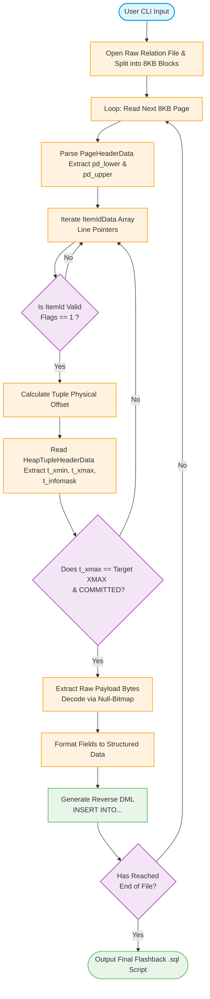

# INTRODUCE

[中文版介绍](https://github.com/baijiu1/pg_hexretro/blob/main/README_zh.md)

# pg_hexretro

[](https://opensource.org/licenses/MIT)
[](https://www.postgresql.org/)

`pg_hexretro` is an advanced, low-level forensic and flashback tool designed for PostgreSQL databases. By performing raw binary analysis on PostgreSQL Heap Relation Files (the underlying table storage), it bypasses the standard SQL engine to inspect block headers, parse item pointers, decode tuple storage byte-by-byte, and facilitate data recovery/flashback for accidentally modified or deleted records.

## Why pg_hexretro?

In PostgreSQL, when a row is `DELETED` or `UPDATED`, the storage engine utilizes MVCC (Multi-Version Concurrency Control). Instead of immediately erasing the physical data, the row (Tuple) is marked as dead by modifying its `t_xmax` header. Before the `VACUUM` process reclaims the space, this data remains intact in the binary heap file.

`pg_hexretro` serves as a digital forensics scanner that reads these raw bytes, interprets the internal layout of standard PostgreSQL pages, and reconstructs "invisible" or deleted tuples back into human-readable data or SQL flashback statements.

## How pg_hexretro




---

## 📐 PostgreSQL Page Layout Deep Dive

To understand how `pg_hexretro` reconstructs data, here is the physical layout of a standard 8KB PostgreSQL page that this tool decodes sequentially:

```text
+-----------------------------------------------------------------------+
| PageHeaderData (24 Bytes)                                             |
| (Contains LSN, flags, pd_lower, pd_upper, pd_special, etc.)           |
+-----------------------------------------------------------------------+
| ItemIdData[0] (Linp1) | ItemIdData[1] (Linp2) | ItemIdData[2] (Linp3) |
| (4 Bytes each, line pointers mapping to actual tuple offsets)        |
+-----------------------------------------------------------------------+
| ......................... pd_lower .................................. |
|                         (Free Space)                                  |
| ......................... pd_upper .................................. |
+-----------------------------------------------------------------------+
|                                               | Tuple 3 (Raw Storage) |
+-----------------------------------------------+-----------------------+
|                       | Tuple 2 (Raw Storage)                         |
+-----------------------+-----------------------------------------------+
| Tuple 1 (Raw Storage)                                                 |
| (Contains HeapTupleHeaderData: t_xmin, t_xmax, t_cid, t_infomask...)  |
+-----------------------------------------------------------------------+
| pd_special (Optional, used in index pages)                            |
+-----------------------------------------------------------------------+
```

pg_hexretro reads pd_lower and pd_upper offsets, extracts valid/dead line pointers (ItemIdData), and then jumps directly to the high-address space to carve out the HeapTupleHeaderData and actual payload bytes.


# Core Features
*Offline Binary Parsing*: Safely scans raw PG table files (e.g., 16384, 16384.1) completely offline without requiring an active PostgreSQL instance or locking shared buffers.

*MVCC Introspection*: Inspects internal header fields (t_xmin, t_xmax, t_cid, t_infomask, t_infomask2) to determine the exact transaction status and visibility of each tuple.

*Flashback Generation*: Automatically maps dead tuples back into reverse DML statements (INSERT statements to recover deleted rows).

*Hex & Text Dual Inspection*: Provides low-level hex alignment views coupled with structural field mapping for quick debugging of corrupted database pages.


# Quick Start
Prerequisites
Supported PG Versions: PostgreSQL 12, 13, 14, 15, and 16.

Compilation Environment: [Go 1.20+ / C99]


```shell
cmake .
make
cd bin/

SHELL> ./pg_hexretro 
Version 1.1 (for PostgreSQL 8.x .. 17.x opengauss 3.x .. 5.x)
Display formatted contents of a PostgreSQL heap fileUsage:
  pg_hexretro dump [options]

Options:
  -D, --db_path <path>
        PostgreSQL data directory

  -f, --file <relfilenode>
        Target relation file

  -d, --database <name>
        Database name

  -t, --table <name>
        Table name

  -e, --export
        Output file name, default format csv

  -s, --sql-mode 
        Only show SQL statement

  -o, --only-visible
        Only dump visible (latest) tuples

  -T, --table-construct
        Only know table construct when pg_class or pg_attribute was dropped

  -v, --verbose
        Enable verbose output

Examples:
  pg_hexretro dump -D $PGDATA -f 66274
  pg_hexretro dump -D $PGDATA -d mydb -t my_table
  pg_hexretro dump -D $PGDATA -d mydb -t users -s
  pg_hexretro dump -D $PGDATA -d mydb -t users -e

```

# Example

/*
  show all tuple version
*/
```shell
SHELL> ./pg_hexretro dump -D $PGDATA -d database_name -t my_table -s
INSERT INTO mixed_data_table("id", "name", "age", "created_at", "description", "score", "created_date", "notes", "updated_at", "rating", "flag", "extra_data", "data_blob", "event_time", "category", "big_count", "amount") VALUES('1009', 'Alice', '25', '2026-04-17 21:18:46.633143+08', 'first record', '88.500000', '2026-04-17', 'note A', '2026-04-17 21:18:46.633143', '4.500000', 'true', '{"city": "Singapore", "tags": ["a", "b"]}', '\xdeadbeef', '12:30:00.000000', 'A001 ', '1234567890123', '999.99'); ctid: (0, 1)
INSERT INTO mixed_data_table("id", "name", "age", "created_at", "description", "score", "created_date", "notes", "updated_at", "rating", "flag", "extra_data", "data_blob", "event_time", "category", "big_count", "amount") VALUES('1007', 'Alice', '25', '2026-05-08 14:05:11.180500+08', 'test description', '95.500000', '2026-05-08', NULL, '2026-05-08 14:05:11.180500', '99.123456', 'true', '{"key": "value"}', '\xdeadbeef', '12:30:45.000000', 'A001 ', '123456789', '9999.88'); ctid: (0, 2)

/*
  only display new tuple version
*/
SQL> DELETE from my_table where id = 1009;
SHELL> ./pg_hexretro dump -D $PGDATA -d database_name -t my_table -o
INSERT INTO mixed_data_table("id", "name", "age", "created_at", "description", "score", "created_date", "notes", "updated_at", "rating", "flag", "extra_data", "data_blob", "event_time", "category", "big_count", "amount") VALUES('1007', 'Alice', '25', '2026-05-08 14:05:11.180500+08', 'test description', '95.500000', '2026-05-08', NULL, '2026-05-08 14:05:11.180500', '99.123456', 'true', '{"key": "value"}', '\xdeadbeef', '12:30:45.000000', 'A001 ', '123456789', '9999.88'); ctid: (0, 2)
```


# CHANGE LOG

| VERSION | UPDATE     | NOTE                                     |
| ------- | ---------- | ---------------------------------------- |
| v0.1    | 2024.8.21  | first version                            |
| v0.2    | 2026.5.21  | support all column types                 |


# CONTACT ME

email: baijiu1100@hotmail.com


